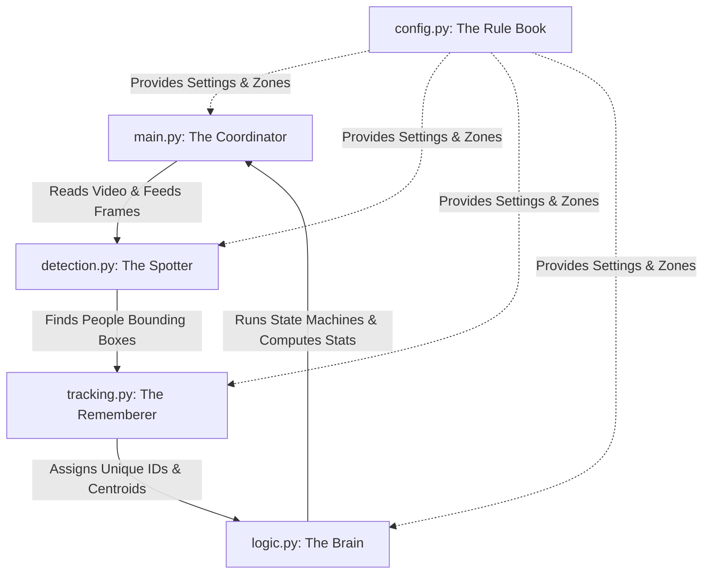

# 🍽️ Restaurant CCTV People Monitoring System
### 🎓 Your Ultimate AI Engineer Interview Preparation Guide

Welcome to the comprehensive interview preparation manual and repository documentation for the **Restaurant CCTV People Monitoring System**. This document is designed to act as your complete companion to help you ace your interviews for **AI/ML Engineer** roles in top Indian tech hubs (Bangalore, Pune, Mumbai, Hyderabad, etc.).

This guide explains the project from the high-level business goals down to the low-level code mechanics, structured as both a codebase reference and an interview preparation handbook.

---

## 📋 Table of Contents
1. [📖 Project Goal & Business Value](#-project-goal--business-value)
2. [👥 System Architecture & Core Modules](#-system-architecture--core-modules)
3. [🏃‍♂️ A Frame's Journey (The Pipeline Flow)](#️-a-frames-journey-the-pipeline-flow)
4. [🛠️ Real-World Engineering Challenges (The "What Went Wrong & How I Solved It" Section)](#️-real-world-engineering-challenges-the-what-went-wrong--how-i-solved-it-section)
5. [💬 The Interview Q&A Cheatsheet (High-Yield Technical Questions)](#-the-interview-qa-cheatsheet-high-yield-technical-questions)
6. [💻 Hands-On Coding Prep (Core Algorithms to Write From Scratch)](#-hands-on-coding-prep-core-algorithms-to-write-from-scratch)
7. [🚀 Quick Start: Installation & How to Run](#-quick-start-installation--how-to-run)

---

## 📖 Project Goal & Business Value

### The Business Case
Imagine a busy restaurant called **The Cozy Diner**. The owner has noticed customer complaints about slow service, but they cannot afford to stand around all day taking notes. They want to answer two simple questions using their existing security camera (CCTV) feed:
1. **How long do customers sit at each table?** (Table Occupancy)
2. **How many times do waiters visit each table?** (Waiter Visits)

Instead of buying expensive custom hardware or smart tables, you build an edge-computational software system that reads the video feed, detects customers and waiters, maps them to table coordinates, and generates actionable service metrics.

---

## 👥 System Architecture & Core Modules

The system is designed to be highly modular and is divided into **five distinct helpers**, each with a dedicated role:



### Module Descriptions
1. **The Rule Book ([config.py](file:///d:/Sem_8/acube_ai_internship/RESTAURANT_PEOPLE_MONITORING/restaurant_management/config.py))**: Stores hyperparameters (like NMS thresholds, object confidence scores), state-machine thresholds, and coordinates of the table boundaries (geofences).
2. **The Spotter ([detection.py](file:///d:/Sem_8/acube_ai_internship/RESTAURANT_PEOPLE_MONITORING/restaurant_management/detection.py))**: An object detector using **YOLOv8** (nano) to locate people inside each video frame.
3. **The Rememberer ([tracking.py](file:///d:/Sem_8/acube_ai_internship/RESTAURANT_PEOPLE_MONITORING/restaurant_management/tracking.py))**: Combines YOLOv8 detections using **ByteTrack** to assign persistent, unique tracking IDs across frames.
4. **The Brain ([logic.py](file:///d:/Sem_8/acube_ai_internship/RESTAURANT_PEOPLE_MONITORING/restaurant_management/logic.py))**: Uses deterministic **State Machines** and geofencing calculations (polygon collision checks) to track customer occupancy periods and waiter service visits.
5. **The Coordinator ([main.py](file:///d:/Sem_8/acube_ai_internship/RESTAURANT_PEOPLE_MONITORING/restaurant_management/main.py))**: The orchestrator. It handles I/O, skip-frame mechanics, displays annotations (HUD overlay), and logs session summary reports.

> **Visual Editor**: [table_zone_editor.py](file:///d:/Sem_8/acube_ai_internship/RESTAURANT_PEOPLE_MONITORING/restaurant_management/table_zone_editor.py) is a GUI utility tool that lets you click on `sample.png` to interactively draw the virtual table boundary polygons and save them directly to [config.py](file:///d:/Sem_8/acube_ai_internship/RESTAURANT_PEOPLE_MONITORING/restaurant_management/config.py).

---

## 🏃‍♂️ A Frame's Journey (The Pipeline Flow)

Every frame follows a strict linear pathway:

1. **Input**: OpenCV decodes a frame from `sample video.mp4`.
2. **Frame Decimation**: [main.py](file:///d:/Sem_8/acube_ai_internship/RESTAURANT_PEOPLE_MONITORING/restaurant_management/main.py) skips every $N$-th frame (e.g. processes 1 out of 2 frames) to cut computational complexity in half.
3. **Perception**: YOLOv8 predicts bounding boxes for the class `person`.
4. **Association**: ByteTrack uses spatial overlapping (IoU) to map the detections to previous tracking records, resolving ID continuity.
5. **Geofencing & Centroids**: The centroid (arithmetic center) of the bounding box is computed. A point-in-polygon algorithm checks if the centroid lies inside any table zones.
6. **State Transitions**:
   * **Customer States**: `WALKING` ➔ `AT_TABLE` (if inside for > 5s) ➔ `LEFT` (when gone for > 2s grace time).
   * **Waiter States**: `IDLE` ➔ `APPROACHING` ➔ `SERVING` (if inside a zone for > 3s).
7. **Visualization & Log**: Annotations are drawn on the frame and written to a processed video, while final statistics are logged to a JSON file.

---

## 🛠️ Real-World Engineering Challenges (The "What Went Wrong & How I Solved It" Section)

Interviewers love to ask: *"What were the edge cases in your data or environment, and how did you resolve them in code?"* Be ready to talk about these 6 critical challenges:

### Challenge 1: The Bounding Box Jitter & Flickering IDs
* **The Drama**: A person sitting at a table might disappear for a frame due to another person walking in front of them (temporary occlusion), or the model's bounding box might fluctuate. If you count occupancy naively on every frame, the system would record dozens of separate, fractional "visits."
* **The Solution**: 
  * **Dwell Time**: A customer must remain inside a table zone for a continuous `CUSTOMER_DWELL_SECONDS` (default: 5.0s) before transitioning to `AT_TABLE`.
  * **Grace Period**: If the tracker temporarily loses a person, the system waits for `LEAVE_GRACE_SECONDS` (default: 2.0s) before terminating their session. If the same ID reappears within the grace period, their dwell session continues seamlessly.

### Challenge 2: The Seated Feet Mystery (Centroid vs. Bottom-Center)
* **The Drama**: In robotics or autonomous driving, standard tracking systems use the **bottom-center** coordinates of a bounding box (where a person's feet touch the ground). However, inside a restaurant, tables and chairs block the view of a seated customer's lower body. The bounding box cuts off at the waist or chest, causing the bottom-center coordinate to move out of the table's zone polygon.
* **The Solution**: Use the **geometric centroid** (`cx, cy`) of the bounding box instead. Because the upper body remains visible while sitting, the centroid remains highly stable and consistently falls within the table's zone geofence.

### Challenge 3: Resolution Mismatch and Coordinate Calibration
* **The Drama**: The table boundary polygons were originally drawn on a static screenshot of resolution `1519 x 853`. However, the actual camera stream processed by the pipeline had a resolution of `848 x 480`. This mismatch meant the geofences were completely offset and misaligned.
* **The Solution**: You implemented coordinates normalization and scaling. Coordinates are mapped and multiplied by width and height scaling ratios:
  $$X_{\text{scaled}} = X_{\text{orig}} \times \frac{848}{1519}, \quad Y_{\text{scaled}} = Y_{\text{orig}} \times \frac{480}{853}$$
  These corrected, scaled coordinates are now baked directly into the default [config.py](file:///d:/Sem_8/acube_ai_internship/RESTAURANT_PEOPLE_MONITORING/restaurant_management/config.py).

### Challenge 4: Waiter Identification without Custom Labeled Data
* **The Drama**: You need to separate waiters from customers, but you do not have custom labeled images of staff uniforms, and uniforms can look identical to customer clothes under different lighting.
* **The Solution**: **Spatiotemporal Behavioral Inference**. You modeled the behavioral differences:
  * A customer walks in, sits at *one* table for a long duration, and leaves.
  * A waiter moves around and visits *multiple* distinct tables over a short duration.
  * **The Rule**: You track a person's behavior during their first `WAITER_OBSERVATION_WINDOW` (default: 2.0 minutes). If they enter $\ge$ `WAITER_ZONE_VISITS_REQUIRED` (default: 3) different table zones within this window, they are permanently classified as a Waiter. Otherwise, they are classified as a Customer.

### Challenge 5: Occlusion & Identity Drift
* **The Drama**: When a waiter leans over a customer to serve food, their bounding boxes overlap. Traditional trackers get confused and swap their IDs, or assign a brand-new ID when they separate.
* **The Solution**: You chose **ByteTrack**. Unlike standard trackers that discard detections with low confidence scores (e.g. < 0.4), ByteTrack keeps them. If a person is partially hidden, their confidence score might drop to 0.25. ByteTrack uses their previous trajectory and Intersection-over-Union (IoU) to associate the low-confidence box to the correct track ID, preventing identity drift.

### Challenge 6: Compute Resource Bottlenecks (Edge Optimization)
* **The Drama**: Running neural network inference on 25 frames-per-second video streams causes CPU/GPU lag on standard commercial edge devices.
* **The Solution**: **Temporal Decimation (Frame Skipping)**. Since human movement and dining speeds are slow, you skip processing every second frame (`PROCESS_EVERY_N_FRAMES = 2`). During skipped frames, you extrapolate tracking positions using the last known coordinates. This cuts model execution overhead in half with zero loss in tracking fidelity.

---

## 💬 The Interview Q&A Cheatsheet (High-Yield Technical Questions)

Use these curated questions to prepare for the technical rounds:

### Q1: Why did you choose YOLOv8 over Faster R-CNN or DETR?
> **Answer**: 
> * **Faster R-CNN** is a **two-stage** detector. It uses a Region Proposal Network (RPN) first, and then classifies those regions. While highly accurate, it is too slow for real-time video inference on edge computers without high-end GPUs.
> * **DETR (DEtection TRansformer)** uses attention mechanisms. It achieves high accuracy but demands significant memory and computational resources, leading to high latency.
> * **YOLOv8** is a **single-stage, anchor-free** detector. It treats object detection as a single regression problem, predicting bounding boxes and class probabilities directly from full images in one pass. We chose `yolov8n.pt` (nano) because it balances accuracy with extremely low latency, enabling it to run at real-time speeds on standard CPUs.

### Q2: How does ByteTrack differ from DeepSORT, and why is it better here?
> **Answer**: 
> * **DeepSORT** matches detections across frames by combining motion (Kalman filters) with **deep appearance descriptors** (a separate convolutional neural network that extracts feature vectors of clothes/looks). This second deep network adds massive computational overhead and is brittle if multiple people wear similar colors (e.g., black shirts).
> * **ByteTrack** relies purely on motion and spatial overlap (**Intersection over Union - IoU**). Its main innovation is **dual association**: it does not discard low-confidence detections (which occur when people are partially blocked by tables or waiters). Instead, it matches high-confidence boxes first, and then associates the remaining low-confidence boxes with existing tracks. This makes it faster and highly robust to occlusion without requiring an auxiliary appearance model.

### Q3: Explain Non-Maximum Suppression (NMS) and IoU.
> **Answer**: 
> * **IoU (Intersection over Union)** measures the overlap between two bounding boxes. It is calculated as the area of overlap divided by the area of union:
>   $$\text{IoU} = \frac{\text{Area of Overlap}}{\text{Area of Union}}$$
> * **NMS** is a post-processing algorithm that eliminates duplicate bounding boxes. If the model outputs several overlapping boxes for the same person, NMS keeps the box with the highest confidence score and discards any other box whose IoU overlap with the main box is greater than a threshold (e.g. `DETECTION_IOU = 0.45`). If set too low, we might merge two people standing close together; if set too high, duplicate boxes remain.

### Q4: Why did you use rule-based state machines instead of a machine learning classifier for customer and waiter roles?
> **Answer**: 
> * **Data constraints**: We did not have a large, labeled dataset of customer and waiter behaviors to train an ML model.
> * **Explainability & Debugging**: State machines are deterministic. If a count is wrong, we can trace the state logs directly and understand which threshold (e.g., dwell time) was triggered. An ML model behaves as a black box and is harder to debug in production.
> * **Robustness**: Uniform designs change, but behavior does not. The rule that waiters visit multiple tables while customers sit at one is a constant, physical reality that requires zero training data.

### Q5: How would you scale this system to handle 100 cameras in a real-world enterprise setting?
> **Answer**: I would propose a three-layer system design:
> 1. **Decouple Decoding and Inference**: Use a queue architecture (e.g. Redis or Kafka). A lightweight process on the edge decodes the RTSP video streams and pushes frames to a queue, while a separate worker pool runs batched inference on GPUs.
> 2. **Edge-to-Cloud Division**: Run the YOLOv8 and tracking models locally on low-cost edge computers (like NVIDIA Jetson modules). Instead of sending raw video files to the cloud (which takes massive bandwidth), send only lightweight JSON metadata (timestamps, track IDs, centroids, state transitions).
> 3. **Time-Series Database**: Save the event logs to a database optimized for time-series events (like TimescaleDB or PostgreSQL) to generate real-time metrics dashboards.

---

## 💻 Hands-On Coding Prep (Core Algorithms to Write From Scratch)

In an interview, you may be asked to implement these core geometric algorithms on a whiteboard or in a live-coding test:

### 1. Intersection over Union (IoU) in Python
```python
def calculate_iou(boxA, boxB):
    # box format: [x1, y1, x2, y2]
    # 1. Determine coordinates of the intersection rectangle
    xA = max(boxA[0], boxB[0])
    yA = max(boxA[1], boxB[1])
    xB = min(boxA[2], boxB[2])
    yB = min(boxA[3], boxB[3])

    # 2. Compute intersection area
    interWidth = max(0, xB - xA)
    interHeight = max(0, yB - yA)
    interArea = interWidth * interHeight

    # 3. Compute area of both individual bounding boxes
    boxAArea = (boxA[2] - boxA[0]) * (boxA[3] - boxA[1])
    boxBArea = (boxB[2] - boxB[0]) * (boxB[3] - boxB[1])

    # 4. Compute Union area
    unionArea = boxAArea + boxBArea - interArea

    # 5. Return IoU
    return interArea / float(unionArea) if unionArea > 0 else 0
```

### 2. Centroid of a Bounding Box
```python
def get_centroid(bbox):
    # bbox format: [x1, y1, x2, y2]
    x1, y1, x2, y2 = bbox
    cx = (x1 + x2) / 2
    cy = (y1 + y2) / 2
    return (cx, cy)
```

### 3. Ray Casting Algorithm (Point-in-Polygon Check)
This algorithm checks if a point $(x, y)$ is inside a polygon with $N$ vertices. It casts an imaginary horizontal ray to the right and counts how many polygon edges it intersects. An odd number of intersections means the point is inside.
```python
def is_point_in_polygon(x, y, polygon):
    # polygon is a list of tuples: [(x1, y1), (x2, y2), ...]
    num_vertices = len(polygon)
    inside = False

    p1x, p1y = polygon[0]
    for i in range(num_vertices + 1):
        p2x, p2y = polygon[i % num_vertices]
        if y > min(p1y, p2y):
            if y <= max(p1y, p2y):
                if x <= max(p1x, p2x):
                    if p1y != p2y:
                        xints = (y - p1y) * (p2x - p1x) / (p2y - p1y) + p1x
                    if p1x == p2x or x <= xints:
                        inside = not inside
        p1x, p1y = p2x, p2y

    return inside
```

---

## 🚀 Quick Start: Installation & How to Run

### 1. Setup the Environment
Create and activate a virtual environment to prevent polluting the global Python environment:

```bash
# Create a virtual environment using Python 3.11
python -m venv venv

# Activate it (Windows)
.\venv\Scripts\activate

# Activate it (Mac/Linux)
source venv/bin/activate

# Install required dependencies
pip install -r requirements.txt
```

### 2. Run the Main Monitoring Pipeline
Run the main execution command. It reads the sample video and displays the annotated tracking window live:

```bash
python main.py --video "sample video.mp4" --show
```

### 3. Using the Interactive Geofence Editor
To redraw the boundary polygons for the tables:
```bash
python table_zone_editor.py --image sample.png
```
* **Left Click**: Add a corner vertex point.
* **Right Click**: Undo the last point.
* **N**: Save current zone and switch to the next table.
* **S**: Save all zones and write coordinates back into `config.py`.

---
💡 **Key Interview Takeaway**: When describing this project to your interviewer, emphasize that **deep learning is only 20% of the work**. The true engineering complexity is building **deterministic logic, geometry algorithms, and state machines** to convert noisy bounding boxes into high-value business metrics.
